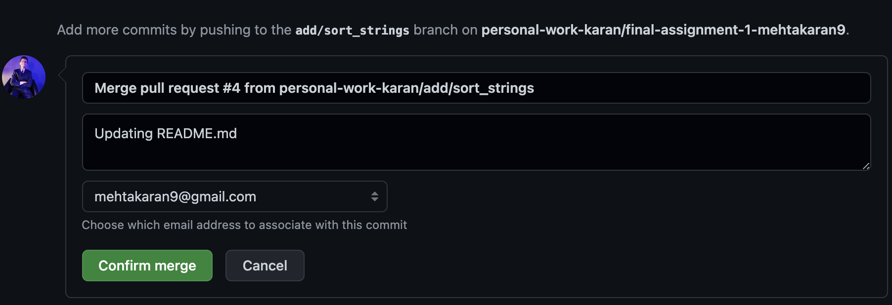

# Homework #1

## ⚠️ We use auto-graders for most parts of the assignment. Please, follow the instructions precisely; you will lose credit for deviances. Stick to the variables’ names and case sensitivity.

## ❗Do not try to modify the already created files under `tests/` directory. These are used to evaluate your submission; changes to these are considered cheating, and will cause your grade to be zero.


## **Objectives**

- Becoming familiar with completing programming assignments/projects using GitHub.
- Get started with git and GitHub
- Learn how to write mark-down documentation and put instructions on how to reproduce work.
- Learn to create both CLI and API.

## Part 1 (30 pts)

### 1.1 Connect to your GitHub using your ssh-key and test your connection.

Make sure you can connect to your GitHub account using your ssh-key. You can find instructions to achieve that here: [https://docs.github.com/en/authentication/connecting-to-github-with-ssh](https://docs.github.com/en/authentication/connecting-to-github-with-ssh).

It is recommended that create a new SSH key for GitHub. Never share your private key :)

### 1.2 Accept the invitation to the assignment

After making sure your environment is ready and you can connect to GitHub via SSH, click on the following URL to accept the assignment invitation. **Link goes here ...**


## Part 2 (30 pts)

You will create a Python project that consists of two parts. The first part is a Python class that can be used as an API (a reusable library) in file `sorter_api.py`. The second part is a Python command-line interface (CLI) application, in file `sorter_cli.py` that uses that class to handle the user arguments and execute the sort function.

**All the source code should exist inside the `src` directory.**

### **GitHub Instructions**

- Create a new branch and name it `add/sort_strings`.
- Checkout  to the newly created branch.
- Develop the needed features in sections 2.1.
- Commit the changes with meaningful commit messages.
- Create a PR into the `main` branch with the changes.
- Add a description to the PR stating what you’ve done.
- Merge into the main branch when you are done with development. DO NOT modify the merge message while merging the branches. 
  For Example: Your merge message should look like the following:

  
- Don’t delete your old branch.

### 2.1 The Python class

You will find a Python class called `Sorter` that has the primary purpose of sorting data.

- We provided the appropriate constructor that can accept:
    1. `sort_type` : either `lexicographically` or `numbers`.
    2. `sort_order`: either `ASC` or `DESC` .

- We Implement a class method `sort_nums` that can accept an iterable of numbers, verifies that all items are integers, then return a sorted list according to the constructor configuration.
- You will implement `sort_strings` that accept list of strings and sort them `lexicographically` in `asc` or `desc` order. YOu can implement `sort_strings` using any algorithm you like. 
- As demonstrated in the example code, you will need to add the proper docstrings and documentation for the newly implemented function.

**Creating a git branch named add/sort_strings will carry 10 points for this part, and the sort_strings operation will carry 10 points. Merging the sort_strings branch into main with a pull request carries 10 points.** 
 

---

## Part 3 Python CLI (30 pts)

> Refer to the GitHub instructions from Part 2 to create a different branch called `add/cli` from your `main` branch once you have merged the previous code.

Inside the `src` directory, you will find a Python script file named `sorter_cli.py` that takes the following positional system arguments. *Please, notice the order and allow case insensitivity in the input parameters.*

1. Sort type: `lex` or `num`
2. Sort order: `asc` or `desc` 
3. Filename to be sorted (plain text file is expected with alphabet words in each line).
4. Output file name

The CLI script should only depend on the simple `sys.argv` to handle the system arguments. The script should import and use the `Sorter`class and invoke the `sort_strings` method. The script’s purpose is to take an input file **(3)**, and write a sorted output file **(4)** with the settings from **(1)**, **(2)**. You will need to sort the lines. Please note that the lines could be either number, or words, not both.

**For example:**

Unsorted file:
```
Zebra
Banana
Apple
```

Sorted file:
```
Apple
Banana
Zebra
```

Unsorted file:
```
4
0
1
```

Sorted file:
```
0
1
4
```

**Creating a git branch named add/sort_strings will carry 10 points for this part, and the sort_strings operation will carry 10 points. Merging the sort_strings branch into main with a pull request carries 10 points.** 

<hr>

## Part 4 Pull Request Merge Order (10 pts)

Throughout this assignment, you will learn about how to create and merge pull requests. Upon finishing this assignment, you will have accomplished two tasks (in that order):

 - Create and merge a pull request to merge your code from `add/sort_strings` branch to the `main` branch.
 - Create and merge a pull request to merge your code from `add/cli` branch to `main` branch.
 
**If your pull request merges occur in that order, you get the credit for this part.**

### Notes

- Don’t use external libraries (unless you provide a `requirements.txt`file.
- Do not use the GitHub application/any other UI application to upload code.
- Depend only on your terminal to get everything done.

### How we will grade

Our desired eductional outcome for this homework is to check that a) You can make the required python changes
(50% of the credit) for each part and b) you Have the proper git history for each part (50% of the credit). Of course,
you also get some points, for getting on Github and setting up your keys etc, and simply just accepting & submitting
the assignment. 

- We will run test cases to check that your code does the API and CLI functions correctly
- We will check the history of your submitted version control repo. We're looking for the following: 

1. You have accepted the course invitation and there is a `main` branch in your repository (Part 1) - 30 points.
2. The string sort program passed the required test cases (Part 2) - 10 points.
3. The `add/sort_strings` branch exists (Part 2) - 10 points.
4. You have created and merged the `add/sort_strings` branch into the `main` branch via a pull request (Part 2) - 10 points.
5. The CLI operation program passed the required test cases (Part 3) - 10 points
6. The `add/cli` branch exists (Part 3) - 10 points
7. You have created and merged the `add/cli` branch into the `main` branch via a pull request (Part 3) - 10 points.
8. The `add/sort_strings` merge occurs before the `add/cli` merge (Part 4) - 10 points
